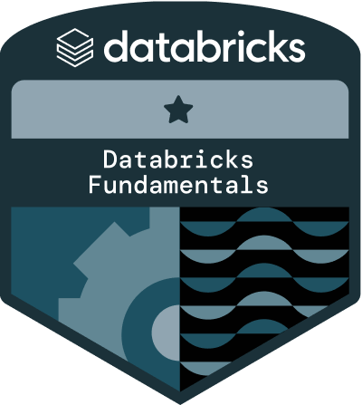
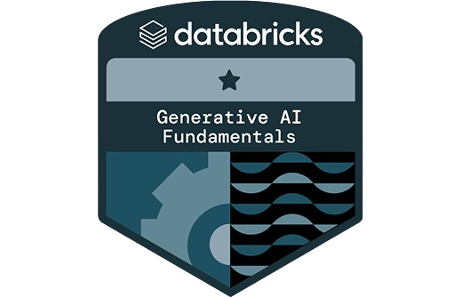
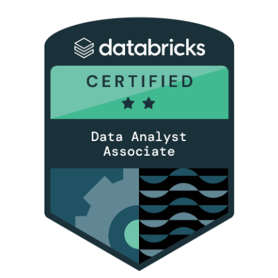

## 👋 Hi, I'm Bassam!

I am currently an Analytics Engineer with a passion for turning data into actionable insights. I hold a [Microsoft Certified: Power BI Data Analyst Associate certification](https://learn.microsoft.com/api/credentials/share/fr-fr/BassamBenidir-2112/D4B4DAC6B147E977?sharingId) and a [Databricks Certified Data Analyst Associate certification](https://credentials.databricks.com/f86ca33d-1008-4722-856e-fd66fb290f5e). I am currently preparing for the **AWS Cloud Practitioner certification** to further enhance my Cloud Computing skills.

👀 Outside of work I'm a part-time 🏋️‍♂️ Calisthenics, Street Lifting and Muay Thaï Athlete: I love challenging myself with bodyweight exercises and pushing my limits in street lifting.

📚 Reading Philosophy: I'm particularly fascinated by Stoicism, and I enjoy exploring its principles to better understand life and improve myself.

💻 Exploring new technologies: I’m always on the lookout for the latest tools and techniques in data analytics and cloud computing.

---

### 🌱 I’m currently learning

- 🔍 **AWS Cloud Practitioner** – Gaining foundational knowledge in cloud computing.  
- 🔍 **Microsoft Fabric** – Exploring unified analytics for end-to-end data solutions.  
- 🔍 **Databricks** – Diving into scalable data engineering and machine learning.  
- 📊 **Advanced Analytics** – Mastering Power BI, SQL, and modern analytics tools.  

---

### 📫 How to reach me

- **LinkedIn**: [Bassam BENIDIR](https://www.linkedin.com/in/bassam-benidir-587b52197/)  
- **Medium**: [Data Mediator](https://medium.com/@bassam.data.mediator)

---

  
### 📊 Higashikata's GitHub Stats

---

### 🎖️ Certifications

#### 🟦 Microsoft

  <table>
    <tr>
      <td align="center">
        <a href="https://learn.microsoft.com/api/credentials/share/fr-fr/BassamBenidir-2112/D4B4DAC6B147E977?sharingId" target="_blank">
          
           Power BI Data Analyst Associate
        </a>
      </td>
      <td align="center">
        
         Fabric Analytics Engineer (In Progress)
      </td>
    </tr>
  </table>

#### 🔴 Databricks

  <table>
    <tr>
      <td align="center">
        
         Fundamentals Lakehouse
      </td>
      <td align="center">
        
         Generative AI Fundamentals
      </td>
      <td align="center">
        
         Platform Administrator
      </td>
      <td align="center">
        <a href="https://credentials.databricks.com/f86ca33d-1008-4722-856e-fd66fb290f5e" target="_blank">
          
           Data Analyst Associate
        </a>
      </td>
    </tr>
  </table>

#### 🟠 AWS

  <table>
    <tr>
      <td align="center">
        
         Cloud Practitioner (In Progress)
      </td>
    </tr>
  </table>

---

  <h2>👨‍💻 My Tech Stack</h2>
  
A showcase of the tools and technologies I work with:

  <table>
    <tr>
      <td align="center" width="100">
        
         Python
      </td>
      <td align="center" width="100">
        
         Linux
      </td>
      <td align="center" width="100">
        
         SQL
      </td>
      <td align="center" width="100">
        
         AWS
      </td>
      <td align="center" width="100">
        
         Power BI
      </td>
      <td align="center" width="100">
        
         Git
      </td>
      <td align="center" width="100">
        
         Microsoft Fabric
      </td>
      <td align="center" width="100">
        
       Databricks
    </td>

    </tr>
  </table>

---

